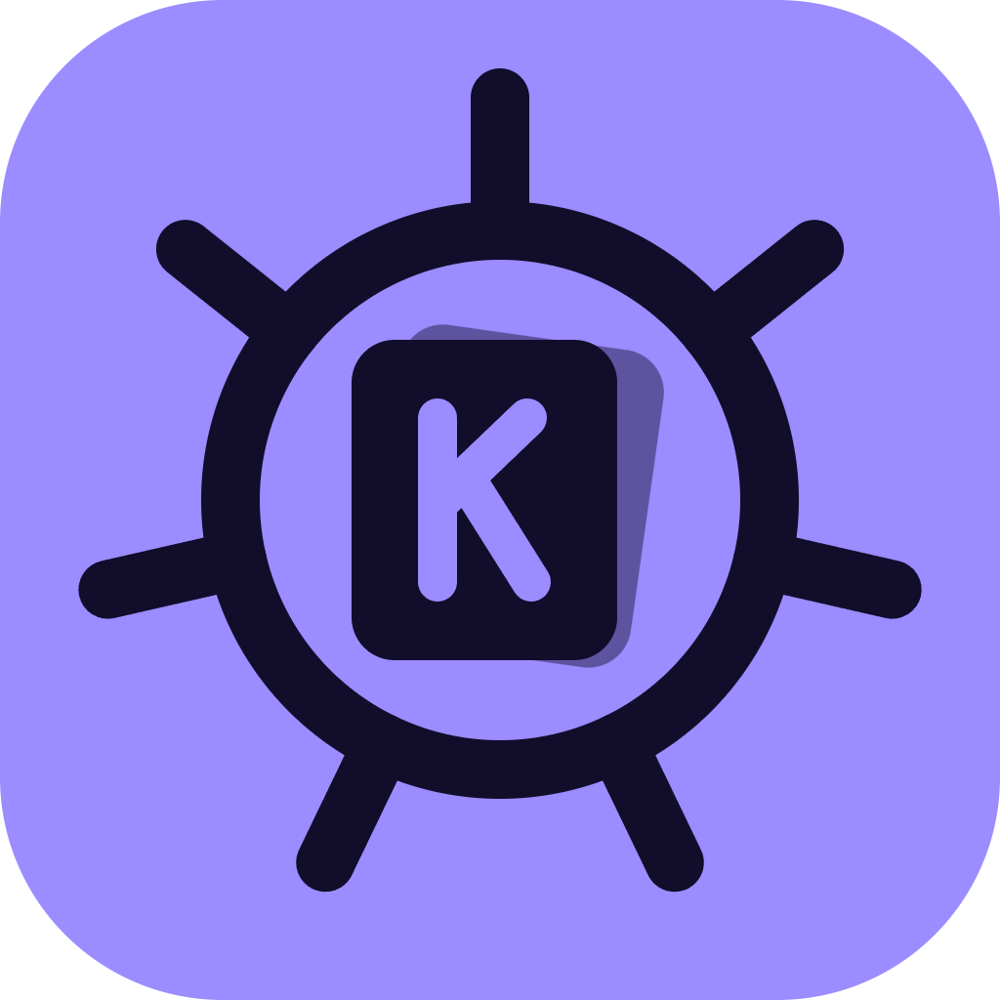

<p align="center">
  
</p>

<h1 align="center">KubeDeck</h1>

<p align="center">
  <strong>A fast, good-looking Kubernetes desktop app for people who live in <code>kubectl</code>.</strong><br>
  Tabs and split panes, live logs, a dashboard that tells you <em>what</em> is broken and <em>why</em>,
  Flux and Helm, port-forward — all on top of the kubectl you already use.
</p>

<p align="center">
  <a href="LICENSE"></a>
  
  
  
</p>

<p align="center">
  
</p>

<p align="center">
  <a href="#try-it-in-one-minute">Try it</a> ·
  <a href="#install">Install</a> ·
  <a href="#features">Features</a> ·
  <a href="#keyboard-shortcuts">Shortcuts</a> ·
  <a href="#security-and-privacy">Security</a> ·
  <a href="#faq">FAQ</a> ·
  <a href="CONTRIBUTING.md">Contributing</a>
</p>

---

## Why KubeDeck

- **It works with every cluster your `kubectl` works with.** k3d, kind, minikube, k3s, EKS, GKE, AKS,
  OpenShift, on-prem. KubeDeck runs *your* `kubectl` and `helm`, so auth plugins
  (`aws`, `gke-gcloud-auth-plugin`, `kubelogin`, OIDC…) and proxies just work. Nothing is installed in the cluster.
- **It tells you why things are broken.** Open a failing pod and KubeDeck explains the cause in plain words —
  out of memory, image tag not found, missing Secret, no node with free memory, namespace quota used up — with the
  evidence it is based on and what to do next. Rule-based, no AI, nothing leaves your machine.
- **Watch many things at once.** Tabs, up to three side-by-side panes and extra windows: logs of one service on
  the left, a Flux Kustomization on the right, the dashboard on a second monitor.
- **Safe on production.** Mark a context as *protected* and every action requires typing the resource name; a
  hazard stripe shows which tab points at it. Every action shows the exact `kubectl` command before it runs.
- **Keyboard-first, like k9s.** `:` jumps anywhere (`:po`, `:deploy`, `:ks`, `ctx prod`), `/` filters, `g` + key
  switches screens.
- **Local and private.** No account, no telemetry, no cloud. Preferences are a single JSON file.

## Try it in one minute

No cluster needed: the demo mode ships with a realistic fake cluster (fictional data).

```bash
git clone https://github.com/<you>/kubedeck.git
cd kubedeck
npm install
npm run desktop:demo     # desktop app
# or: npm run demo       # same thing in your browser
```

When you are ready, run `npm run desktop` instead and KubeDeck uses your real kubeconfig.

## Install

### Download (recommended)

Grab the latest build from the **[Releases](../../releases)** page:

| OS | File |
|---|---|
| Windows | `KubeDeck-x.y.z-win-x64.exe` (installer) or the portable `.exe` |
| macOS | `KubeDeck-x.y.z-mac-*.dmg` |
| Linux | `KubeDeck-x.y.z-linux-*.AppImage` or `.deb` |

Builds are not code-signed yet: Windows SmartScreen may ask you to confirm ("More info" → "Run anyway") and on
macOS you may need to right-click the app and choose "Open" the first time.

You need `kubectl` in your `PATH` (and `helm` for the Helm screens). For AKS, the Azure CLI (`az`) and, for
Entra ID clusters, `kubelogin`.

### From source

Requirements: Node 20+.

```bash
npm install
npm run desktop          # build and open the desktop app
npm run dist:win         # or build your own installer into release/ (dist:win works on Windows)
```

### Browser mode

Prefer a browser tab? The same app runs as a local web server:

```bash
npm run build
npm link                 # installs the "kubedeck" command
kubedeck                 # opens http://127.0.0.1:<port>/?t=<token>
```

Options: `--port 7420`, `--no-open`, `--demo`. After pulling new code, run `npm run build` again and restart
`kubedeck`. Having trouble on Windows? See [Troubleshooting](#troubleshooting).

## Features

### "Why isn't this pod running?"


For unhealthy Pods, Deployments, StatefulSets, DaemonSets, ReplicaSets and Jobs, the Overview tab shows a
diagnosis card: the likely cause, the evidence (status fields, events, the last log lines before the crash) and
what to do. One click opens the previous logs, the YAML or the events. It recognizes about 40 situations, including:

- out of memory (with or without a limit), crash loops with the last log lines, exit codes 126/127/137
- image not found, no permission to pull, registry unreachable
- missing Secret, ConfigMap, key or PVC — and where the pod uses it
- unschedulable pods: not enough CPU/memory, taints, node affinity, volume zone, pod limits
- failing readiness, liveness and startup probes
- namespace quota exhausted, admission webhooks rejecting pods, missing ServiceAccount
- stuck rollouts, failed Jobs, evicted pods, pods stuck terminating

The dashboard's *Needs attention* list shows the short version of each diagnosis.

### Live logs


Follow one pod or a whole Deployment (all pods, prefixed), pick the container, see the previous run after a
restart, search and highlight, and download as `.log`. Every line gets an `ERR` / `WARN` / `INFO` / `DBG` badge.

### Tabs, split panes and windows


Each tab keeps its own context, namespace, filter and back/forward history. Ctrl+click or middle-click a row to
open it in a new tab, where its logs keep streaming in the background. Split into up to three panes, drag tabs
between them, or pop a tab out into its own window. Tabs are restored the next time you open KubeDeck.

### Protected contexts and safe actions


Day-to-day actions — restart, scale, delete pod, Flux reconcile / suspend / resume — always show the exact command
first. On a protected context you have to type the resource name to confirm. The *Commands* panel lists everything
KubeDeck ran, ready to copy into a terminal.

### Port-forward


Forward pods, services, deployments and statefulsets with the exposed ports pre-filled. Active forwards live in a
panel where you can open, copy or stop them; they stop when KubeDeck closes.

### And also

- **Dashboard:** node and pod health, cluster and per-node CPU/memory against allocatable capacity and requests,
  top pods by CPU and memory, recent warnings (usage numbers need `metrics-server`, bundled with k3s and AKS).
- **Every resource:** workloads, Services, Ingresses and Traefik IngressRoutes, ConfigMaps, Secrets (decoded,
  masked until revealed), storage, nodes, events, and any CRD from your cluster.
- **GitOps:** Flux Kustomizations, HelmReleases and sources with their Ready state and messages; Helm releases with
  status, values, history and manifest.
- **Detail panel:** overview with related resources (a Deployment's pods, a pod's node, the ConfigMaps and Secrets
  it uses…), describe, highlighted YAML, events.
- **AKS helper:** add a cluster to your kubeconfig from the UI using your `az login` (see below).
- **Your language:** English and Portuguese, more welcome ([how to add one](CONTRIBUTING.md#adding-a-language)).

## Usage

### Contexts and namespaces

KubeDeck reads the contexts in your kubeconfig and never changes your `current-context`: each tab passes
`--context` explicitly. If your user cannot list namespaces, the namespace picker becomes a text field that
remembers what you typed.

Click the lock next to the context picker to **protect** it. Recommended for shared and production clusters.

### AKS clusters

1. Run `az login` in a terminal.
2. Click **Add cluster** next to the context picker (or `:` → "Add AKS cluster"). Pick the subscription, use
   **Find clusters**, and optionally set a default namespace. KubeDeck shows and runs:
   ```
   az account set --subscription <subscription>
   az aks get-credentials --resource-group <rg> --name <cluster> --context <context> --overwrite-existing
   kubelogin convert-kubeconfig -l azurecli --context <context>      # optional
   kubectl config set-context <context> --namespace <namespace>      # if given
   ```
3. Open the new context. If the Azure token expires later, a banner asks you to run `az login` and retry.

### Keyboard shortcuts

| Key | Action |
|---|---|
| `:` or `Ctrl+K` | Go to a resource, context or namespace (`po`, `deploy`, `hr`, `ks`, `ctx name`, `ns name`) |
| `/` | Filter the list (several words, or labels such as `app=api`) |
| `Esc` | Close the panel |
| `g` then `d` / `p` / `y` / `s` / `k` … | Dashboard / pods / deployments / services / Kustomizations … |
| `g` then `f` / `l` | Port-forwards / executed commands |
| `Alt+←` / `Alt+→` | Back / forward in the current tab |
| `Ctrl+T` / `Ctrl+W` / `Ctrl+Tab` | New / close / next tab (desktop app; `g t` / `g w` in the browser) |
| `Ctrl+\` / `Ctrl+N` | Split right / open the tab in a new window (desktop app) |
| `?` | All shortcuts |

## Security and privacy

```
┌──────────── your machine ─────────────┐
│  KubeDeck UI ──▶ local server         │        ┌─────────────────┐
│                  127.0.0.1 + token    │──────▶ │ your clusters   │
│                  runs kubectl / helm  │        │ (your kubeconfig│
│                  / az with your creds │        │  and RBAC)      │
└───────────────────────────────────────┘        └─────────────────┘
```

- Nothing is installed in your clusters, and KubeDeck can never do more than your own credentials allow.
- The server listens on `127.0.0.1` only and every request needs a random token created at startup.
- Commands run without a shell, and the only write actions are the allow-listed ones above.
- Secret values are fetched only when you open them and are never stored.
- No telemetry and no network calls of its own; fonts and assets are bundled, so it works offline.
- The only file it writes is `~/.kubedeck/settings.json` (UI preferences).

Found a vulnerability? Please report it privately — see [SECURITY.md](SECURITY.md).

## FAQ

**How is it different from k9s, Lens or Headlamp?**
KubeDeck keeps the k9s idea — fast, keyboard-driven, runs on your machine — and adds a visual interface with tabs,
split panes and explanations of failures. Unlike in-cluster dashboards it needs nothing deployed in the cluster,
and it reuses your `kubectl` instead of its own Kubernetes client, so every auth setup you already have works.

**Can I use it at work?** Yes. It is MIT-licensed, uses your existing access, sends nothing anywhere, and
protected contexts make accidental changes on production hard.

**Does it work without `metrics-server`?** Yes. The dashboard then shows requests instead of live usage.

**Which actions can it perform?** Restart, scale, delete pod, Flux reconcile / suspend / resume, and adding an
AKS context. Editing YAML, exec and rollbacks are on the [roadmap](#roadmap).

## Troubleshooting

<details>
<summary><strong>"kubedeck is not recognized as the name of a cmdlet…" (Windows, browser mode)</strong></summary>

`npm link` creates `kubedeck`, `kubedeck.cmd` and `kubedeck.ps1` in npm's global folder. If that folder is not in
your `PATH`, PowerShell can't find them. Check:

```powershell
Get-ChildItem (npm prefix -g) -Filter "kubedeck*"                    # the 3 files should be listed
$env:PATH -split ';' | Select-String -SimpleMatch (npm prefix -g)   # prints nothing = folder not in PATH
```

Add the folder to your user `PATH` (no admin rights needed), then open a new terminal:

```powershell
[Environment]::SetEnvironmentVariable('Path', [Environment]::GetEnvironmentVariable('Path','User') + ';' + (npm prefix -g), 'User')
```

If your `PATH` gets reset at login, add it to your PowerShell profile instead
(create it first with `New-Item -ItemType File -Force $PROFILE`):

```powershell
Add-Content $PROFILE "`n`$env:PATH += ';' + (npm prefix -g)"
```

- **The 3 files are missing:** `npm link` failed, often with `EPERM` when npm's folder is under `C:\Program Files`.
  Run `npm config set prefix "$env:APPDATA\npm"` and `npm link` again.
- **"running scripts is disabled on this system":** use `kubedeck.cmd` instead.
- **No global command at all:** run `npm start` from the project folder.

</details>

<details>
<summary><strong>The desktop app can't find kubectl, helm or az</strong></summary>

The desktop app uses your system `PATH`, like a new terminal. If a tool only works inside a shell that changes
`PATH` in its profile, add that tool's folder to your user `PATH`.

</details>

<details>
<summary><strong>"Azure session expired" banner</strong></summary>

Run `az login` in a terminal and click **Retry**. For Entra ID clusters, make sure `kubelogin` is installed
(`az aks install-cli`) and the context was converted with `kubelogin convert-kubeconfig -l azurecli`.

</details>

## Roadmap

- Shell inside a container (`kubectl exec`)
- Rollout history and rollback, Helm rollback
- Edit YAML with a diff before applying
- Relationship map (Ingress → Service → Workload → Pods), currently behind a feature flag
- Instant updates with `kubectl --watch` instead of polling
- More languages

Ideas and votes are welcome in [issues](../../issues).

## Contributing

Contributions of all sizes are welcome — see [CONTRIBUTING.md](CONTRIBUTING.md) for the setup (the demo mode
means you don't even need a cluster), project layout, and how to add a diagnosis rule or a language.
Please follow the [code of conduct](CODE_OF_CONDUCT.md).

## License

[MIT](LICENSE) © KubeDeck contributors
